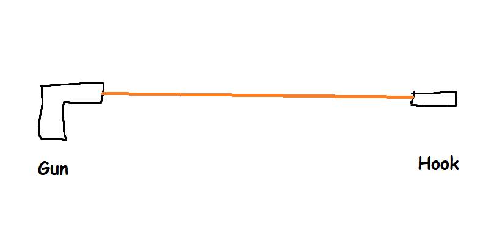
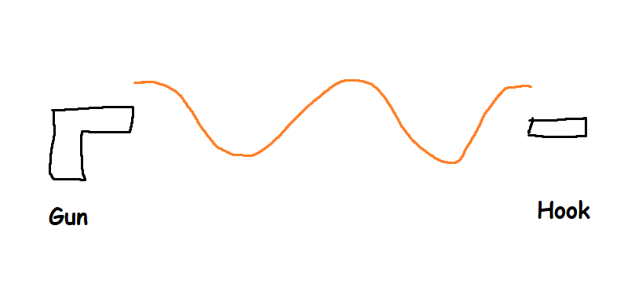
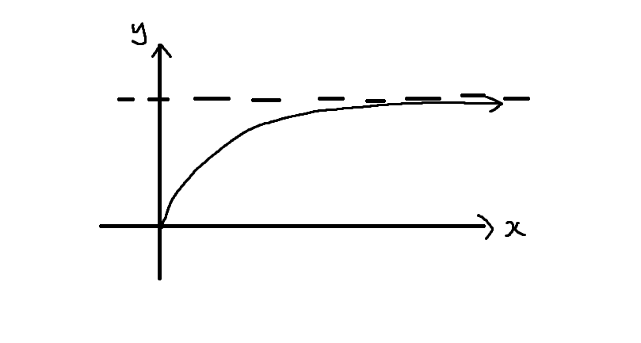
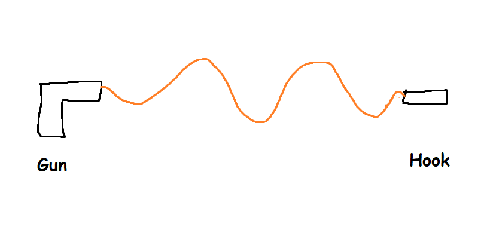
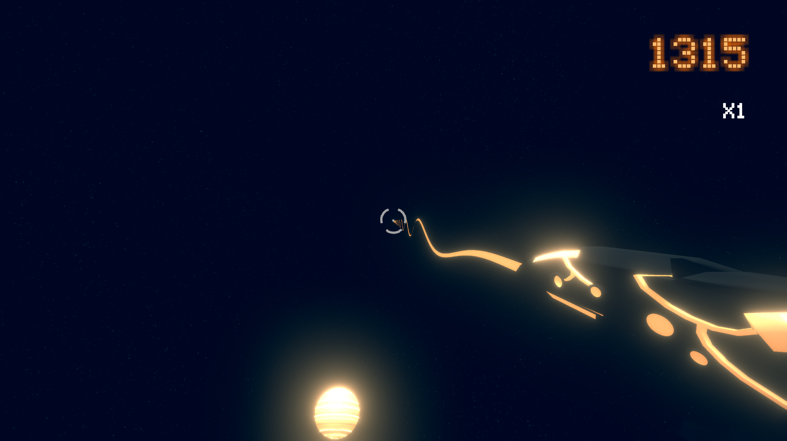
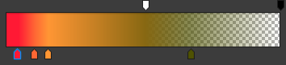
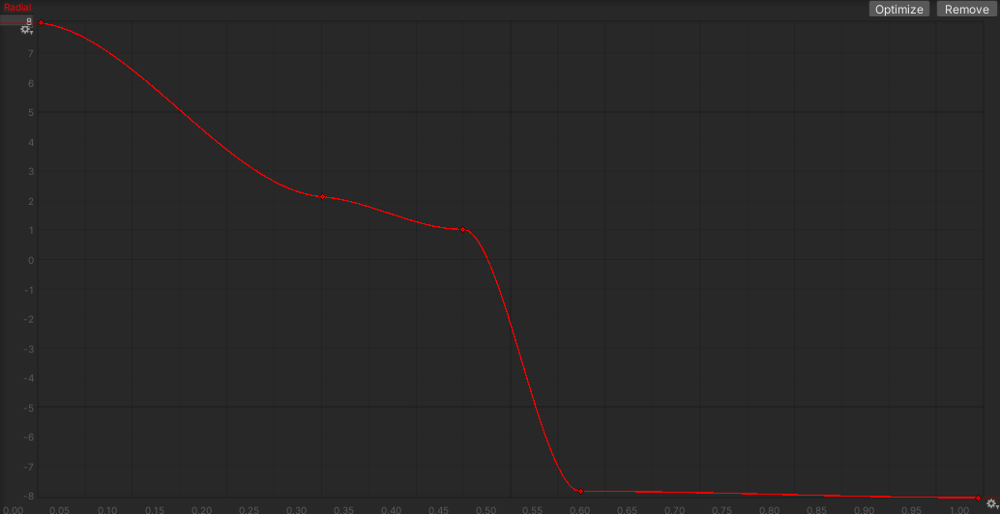
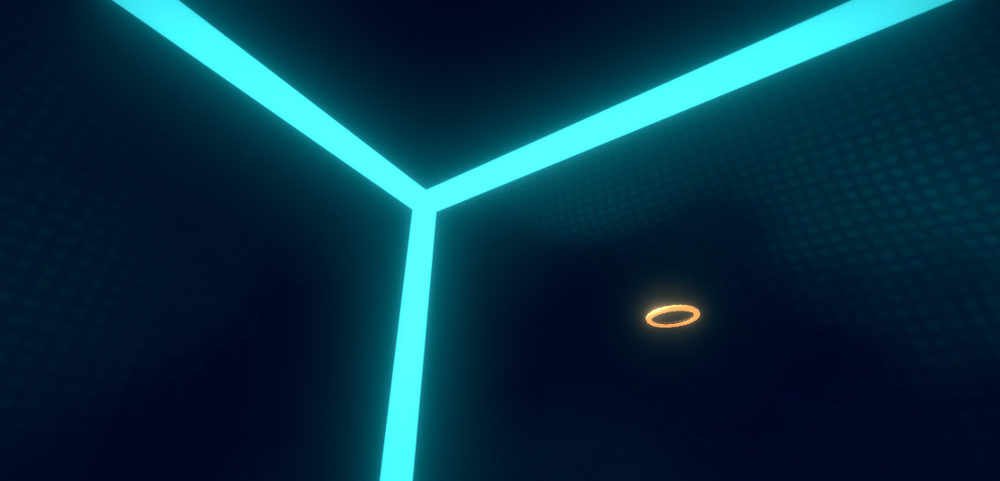

**The University of Melbourne**

# COMP30019 – Graphics and Interaction

# Project-2 README

# Game: NBA 2K77

<p align="center">
  
</p>

**Gameplay video:** [https://www.youtube.com/watch?v=-2TXDMclXc4](https://www.youtube.com/watch?v=-2TXDMclXc4).

## Table of Contents
- [COMP30019 – Graphics and Interaction](#comp30019--graphics-and-interaction)
- [Project-2 README](#project-2-readme)
- [Game: NBA 2K77](#game-nba-2k77)
  - [Table of Contents](#table-of-contents)
  - [Explanation of the Game](#explanation-of-the-game)
    - [How to Play](#how-to-play)
  - [Overall Design Goals](#overall-design-goals)
  - [Technologies](#technologies)
  - [Modelling Objects and Entities](#modelling-objects-and-entities)
  - [Graphics Pipeline](#graphics-pipeline)
  - [Camera Motion](#camera-motion)
  - [Shaders](#shaders)
    - [Shader 1: Grappling Rope](#shader-1-grappling-rope)
    - [Shader 2: Hoop Ripple](#shader-2-hoop-ripple)
  - [Special Effects](#special-effects)
    - [Hoop Explosion Effect](#hoop-explosion-effect)
  - [Querying and Observational Methods](#querying-and-observational-methods)
    - [Demographics](#demographics)
    - [Methodology](#methodology)
      - [Think Aloud](#think-aloud)
      - [Post Walkthrough Interview](#post-walkthrough-interview)
    - [Feedback and Solutions](#feedback-and-solutions)
      - [The game felt too floaty](#the-game-felt-too-floaty)
      - [Visual Noise from skybox](#visual-noise-from-skybox)
      - [Lack of instruction](#lack-of-instruction)
      - [Difficulties with aiming](#difficulties-with-aiming)
    - [Grappling to hoop results in players orbiting the hoop](#grappling-to-hoop-results-in-players-orbiting-the-hoop)
  - [Individual Contributions](#individual-contributions)
    - [Gatlee Kaw](#gatlee-kaw)
    - [Steven Nguyen](#steven-nguyen)
    - [Matthew Lui](#matthew-lui)
    - [James Dyer](#james-dyer)
  - [External Resources](#external-resources)


## Explanation of the Game

In the year 2077, basketball has been made obsolete by a new sport, __Neo-Basketball__. 

Neo-Basketball looks a lot like our basketball, except there's more balls, more hoops, and only slam dunks. It features the most important invention of the 21st century, the Light Grappling Hook™.

Swing and dunk your way through several NNBA™ approved levels as you attempt to set a world record score in the most anticipated game of 2021.<sup>[[citation needed]()]</sup>

You are Kobe Sakurai the Second, hot-headed and ready to make up for your father's defeat of the 13th Space Jam of 2068. Your family's honour rests upon the upcoming game. I hope you are ready, son. The world awaits... __Now get out there and JAM!__

# TODO: Image of kobe briant


### How to Play

To start the game from Unity, open the ```mainmenu``` scene and press play. 

A tutorial will guide you through the key game mechanics. We have implemented familiar first-person shooter controls: WASD to move, space to jump, left click to shoot your grappling hook and escape to pause. By holding down left click, your grappling hook can be used to swing and pull balls towards you. The crosshair will change colour when you are aiming at a hoop or ball.

Once you're done with the tutorial, try to build up the highest score possible on each of our levels! Score points by picking up balls, flying and dunking before the time runs out. To acieve the highest score, build up a score multiplier by picking up multiple balls without touching the ground.

You can practice your favourite levels in sandbox mode, where balls reset, hoops don't deactivate and the time limit is removed.


## Game Design

### Design Pillars

At the beginning of the project, after brainstorming and coming up with the initial concept, we decided to establish several design pillars to refer back to when making design decisions over the course of the project. Formalising our ideas in this way let us stay focused on a core vision for how the game should play. The design pillars were as follows:

- Movement is fun
- Agile movement is rewarded
- Enter the flow state
- Room for mastery

This cemented our concept of the game as one about centred around fast-flowing movement and mastery of the mechanics. It also guided our later design decisions, including the way we set up the score system to ensure that optimal play was the intended and most fun way to play the game, or our removal of obstructions to the main gameplay flow such as the necessity for precision aiming with aim assist.

# TODO: explanation of how we tweaked the score system to encourage people to play in the intended way or other stuff e.g. deactivating hoops

## Technologies

The project was created with Unity 2019.4.3f1.

## Modelling Objects and Entities

For development simplicity, the majority of our objects are based on Unity primitives. For example, the platforms are transformed cubes and the balls are spheres. These primitives come with robust meshes and colliders. We styled these assets with custom materials, shaders and post-processing effects to suit our needs.

In some cases, Unity's primitives were not sufficient. We needed a torus and high-vertex sphere for our hoop, so we created and exported these models from Blender. We further sourced the grappling gun and skybox from the Unity asset store.

Complex entities, such as the hoop and player body, are a combination of multiple objects and colliders, saved as a prefab for use across every scene.

## Graphics Pipeline

# TODO: explain graphics pipeline

- Vertex vs frag shader
- post-processing
- canvas? e.g. multiple canvases, some use post-processing and so they're in world space

## Camera Motion

In game, the camera is rigged to the player body (actually a child of its transform). The camera rotates to follow the mouse in standard style of first-person games.

This camera style was chosen to be very intuitive, and more suited to gameplay involving aiming as compared to, say, a third-person perspective. The first-person perspective is also more immediate and conducive to immersion, which is helpful in conveying more direct experiences like the visceral experience of fast motion.

## Shaders

### Shader 1: Grappling Rope

# TODO: explain shader 1

Our first shader was decided to be applied to our grappling hook. Our initial implementation of the grappling hook had a simple line renderer being drawn between the player's gun and the hook.


<p align="center">
  
</p>

However, this had a couple negatives: 

- It looked boring
- It didn't provide the user feedback when they had attached their hook to a surface. 

We decided to add a shader to the length of the line renderer. This would make the rope appear to 'whip' outwards and then pull taut when attaching to an object.

The first implementation was done so rudimentarily as follows:

```glsl
float distanceFromGun  = abs(distance(v.vertex, _GunLocation));
float displacement = _Amplitude * sin(lengthA * _Wavelength);
```
<p align="center">
  
</p>

However, this made it so the rope did not attach to the hook or the gun. We wanted a function to modify the amplitude of the Sine wave when it is closer to both ends. Partically we were looking for a function that passed through the origin and approached a asymptote. The function that ended up having these properties was a variant of the hyperbola.

<p align="center">
  
</p>

```glsl
float normaliseAmplitude(float d)
{
  return (-0.3f/(d + 1.0f)) + 0.3f;
}
```

```glsl
// Get distance of vertex on line from Gun and Hook
float lengthA  = abs(distance(v.vertex, _GunLocation));
float hookDistance = abs(distance(v.vertex, _HookLocation));

// Clamp the function to 0 if close to the gun or hook
// Because of the nature of the function, they reach a value asymptopically for larger x
// This is good because it makes the Sine wave not grow with distance
float gunNorm = normaliseAmplitude(lengthA - 0.98f);
float hookNorm = normaliseAmplitude(hookDistance - 0.98f);
```

Let's have a look at all the parts of our final displacement function
```
float4 displacement = min(gunNorm, hookNorm) * sin(lengthA - 0.98f + _Time[3]*10) * _Up * _Amplitude;
```

`min(gunNorm, hookNorm)` modifies the magnitude of the Sine wave so that it is 0 close to hook or gun, but some constant c at max
`sin(lengthA - 0.98f + _Time[3]*10) * _Up` This is the actual sine wave, wobbles vertically and with time.
`_Amplitude` This is the property we pass in from `GrappleHook.cs` to manage the the animation of the hook becoming taut

<p align="center">
  
</p>

To make it pull taut once the hook is attached, added a property to the shader `float _Amplitude`. Once the hook is attached, inside the`GrappleHook.cs` script we Lerp the amplitude from 1 - 0 within 8 frames, and pass it to the shader through the property. This makes the displacement = 0, and thus make the shader render it as a simple straight line, signifying that the rope is taut.

#### Here is the final result!

<p align="center">
  
</p>

### Shader 2: Hoop Ripple

<p align="center">
  
</p>

Our second shader is for a wave/ripple-like effect for the inside surface of each hoop. This is achieved by displacing the height of each of the vertices on the surface of the hoop by a sine wave which is a function of the distance from the centre and the current time, generating a radially symmetric rippling effect.

This is calculated in a vertex shader as follows:

```glsl
// Apply a sine wave displacement based on distance to center
float d = length(float2(v.vertex.x, v.vertex.z));
float freq = 1.0 / _Wavelength;
float offset = _Time.y * _Speed;
float t = d * freq + offset;
float h = sin(t);
v.vertex.y = _Amplitude * h;
```

In order to allow for lighting to be calculated properly for the displaced vertices, the normals are also recalculated. If we consider the function we are applying to be `f(x, z)` mapping to an `(x, y, z)` point, we can get the following expression:

`f(x, z) = (x, _Amplitude * sin(freq * d + offset), z)`

In order to calculate the normal vector, we can take the cross product of the partial derivatives `df/dx` and `df/dz`. We have

`df/dx = (1, _Amplitude * cos(t) * freq / d * x, 0)`

and

`df/dz = (0, _Amplitude * cos(t) * freq / d * z, 1)`

where `t = d * freq + offset` as above.

Taking the cross product gives us the vector:

`(_Amplitude * cos(t) * freq / d * x, -1, _Amplitude * cos(t) * freq / d * z)`

In addition, in order to prevent artifacts occuring near the centre of the mesh, we enforce that normals very near to the centre face strictly downwards, creating a small flat spot in the middle. This issue appeared to be due to an irregularity with our mesh, which was created by squashing a sphere down to be very thin and treating it as a disc.

Overall, this leads us to the following:

```glsl
// Calculate new normal
float3 normal;
if (d < 0.01) {
  // Keep the centre looking consistently flat
  normal = float3(0, -1, 0);
} else {
  // Normalized cross product of df/dx and df/dz (partial derivatives)
  normalize(float3(
    _Amplitude * cos(t) * freq / d * v.vertex.x,
    -1,
    _Amplitude * cos(t) * freq / d * v.vertex.z));
}
```

In order to accentuate the overall rippling effect, we also vary the color of each vertex based on the height calculated from the sine wave. This is done by linearly interpolating a coefficient to multiply the color by between some set limits.

```glsl
// Interpolate color based on adjusted height
float c = lerp(_ColorMinValue, _ColorMaxValue, (h + 1) / 2);
o.color.rgb = c * _Color;
```

Here the value of `h` is `sin(d * freq + offset)` as calculated previously.

Finally, a Phong illumination model is applied in a pixel shader using code taken from the workshops to get some simple lighting effects.

## Particle Systems

<p align="center">
  
  <br>
  The dunk effect.
</p>

The explosion effect plays when balls are dunked and the player is thrown away from the hoop. It is composed of a smoke puff, shockwave and electric embers. It uses textures for the official Unity particle pack.

The smoke puff randomly emits a small number of puffs within a spherical region. We adjusted the color over lifetime to fade to lower hues of red with increasing transparency as the puffs dissipate.

<p align="center">
  
  <br>
  The smoke puff's colour over lifetime.
</p>

The shockwave spawns a circular disk at the base of the explosion, increases in size over lifetime, then reduces back to the original state.

Finally, the movement of the electric embers is dictated by a velocity over lifetime curve. We emit a large number from a hemisphere, with positive radial velocity. To give the effect of the embers flying back and the hoop 'resetting', the velocity over lifetime curve is set to drop to negative, which brings them back towards the center.

<p align="center">
  
  <br>
  The ember's velocity over lifetime.
</p>

The explosion effect on deactivated hoops is muted, with fewer emitted particles and lower velocity. 

<p align="center">
  
</p>

## Querying and Observational Methods

### Demographics

| \#  | Age | Gender | Occupation         |
| --- | --- | ------ | ------------------ |
| 1   | 21  | Male   | University Student |
| 2   | 21  | Male   | University Student |
| 3   | 21  | Male   | University Student |
| 4   | 12  | Male   | School Student     |
| 5   | 18  | Male   | University Student |
| 6   | 20  | Male   | University Student |

Ideally, it would have been desirable to survey a larger number of people with much more diverse demographics in order to receive more varied feedback, but that was difficult to do given the current situation.

### Methodology

We used two Querying/Observational methods:

- Think Aloud
- Post Walkthrough Interview

#### Think Aloud

For our observational method, we gave the users a small set of instructions on how to play the game as well as an instruction to voice out their thoughts.

From there, minimal input from the interviewer was given as users attempted to play through our levels. We recorded any issues or interesting points we noticed from observing their gameplay, as well as any frustrations or suggestions they voiced.

#### Post Walkthrough Interview

The post walkthrough interview questions we used were:

- Did the game feel too fast or too slow? How was the pace?
- Was the game easy to understand?
- What pain points did you encounter during the game?
  - Aiming?
  - Movement?
  - Ball dunking?
- Would you change any other aspect of the game?
  - Visuals
  - Gameplay
- What new features would you like?
- How do the controls compare to other games you’ve played?
- Do you have any other thoughts you would like to discuss?

These questions were ordered to sandwich the most difficult questions in the middle of the interview, to allow interviewees to warm up. We also asked follow-up questions about their responses.

# TODO: talk more in detail about methodology: sharing screens, taking notes, etc.

### Feedback and Solutions

Through our observational/querying methodologies, we were able to pick up on common complaints and misunderstandings with the mechanics of our game. These included complaints about game feel as well as visual clarity in general. Here is an overview of the most common points of feedback, along with the solutions we came up with.

#### Difficulty with "Floaty" Controls

A common complaint with our gameplay was that it felt very "floaty". Especially the jumping as well as the movement through the air. Many of the players seemed to struggle with moving the character in the way they wanted.

The main cause we identified for this was that the maximum speed we had set for travel through the air was much too high. Moving too quickly led to players being unable to aim and position themselves effectively.

Therefore, we decided to reduce the maximum air speed (enforced by a "braking force" applied to the player in the opposite direction of their movement if they travel too fast). Crucially, we set different speed limits depending on whether the player was currently grappling. This allowed us to set a high maximum for when the player is grappling, and lower it for when they are simply airborne without being pulled. This has the side effect of significantly slowing down the player when they release a grapple, which provides a good gameplay flow of fast grapples with small pauses in between to re-orient and grapple again.

In order to provide better information to the player about their velocity and accentuate the sensation of fast movement, we also had the FOV scale with the player's speed, increasing slightly as the player accelerates.

#### Difficulties with Aiming

We observed that users often committed to grappling balls, expecting it to hit, and then were often disappointed or frustrated when they missed the ball. Since the core gameplay is based around near-constant fast and dynamic movement, aiming at small targets like the balls is particularly difficult. Additionally, we didn't want difficulties with aiming to be prominent as we did not consider it to be the core drive behind the game concept - that being skillful movement and flow.

To solve this, we implemented an "aim assist" feature to improve aiming usability and decrease the chance of a player missing a ball and interrupting the flow of gameplay.

This was implemented by first conducting a sphere cast, covering a fairly sizeable area in the general direction the player is looking, and checking if a ball is present. If this succeeds, the direction vector in which the player is looking is shifted a small amount of degrees (2-3) in the direction of the detected ball. (This number was chosen to match the size of the crosshair in the player's view). A raycast is then done in this direction to determine if the player has a direct line of sight to the ball. If this succeeds, the player's crosshair changes color to orange to clearly indicate that a shot hook would hit the target. If the player then fires a hook, it is aimed towards that point.

<p align="center">
  
  <br>
  Aim assist on a ball.
</p>

After testing out this feature, we found that it greatly improved the general flow of the game, and extended it to apply to hoops as well. 

#### Visual Noise from Skybox

The skybox presented some issues with clarity. Since the skybox featured a similar grid-like pattern of black and bright blue to the platforms, it often made it difficult for players to make out the platforms against the backdrop.

<p align="center">
  
  <br>
  The previous skybox.
</p>

This was solved by changing the backdrop to one which is more contrasting with the platforms and other game objects. (Mostly black, as if in space, but above the Earth to avoid just being in a black void.)

#### Lack of Instruction

Players mentioned that without us telling them the controls, there would be no way to discover the mechanics of the game. In response, we implemented a simple tutorial which which guided the user through the controls and objectives of the game in an interactive manner.

#### "Orbiting" Hoops

Several players encountered an issue where they would attempt to grapple towards a hoop while having significant lateral velocity, which caused them to overshoot. Since the force being applied by the rope was constant, they then entered into a stable elliptical orbit around the hoop, and kept swinging around in circles as long as they held down the button.

<p align="center">
  
  <br>
  Demonstration of the orbiting effect.
</p>

We had also found this issue while testing manually, and found that it greatly obstructed the gameplay, as it prevents you from easily reaching the hoop to dunk a ball, an essential part of the core gameplay loop.

To fix this, we applied a positive jerk (rate of change of acceleration) to the pulling force. More simply, we made the pulling force increase the longer the player has been grappling. We set this value low for when grappling onto regular surfaces, but increased it greatly for the hoop specifically. This increasing force over time causes the player to "crash" out of orbit and hit the hoop very quickly in most instances. Even if they overshoot greatly, most of the time they will only complete a few revolutions before reaching the hoop, so we considered the problem to be solved.

#### Score & Intended Gameplay Ignored

One recurring point that we observed in players was that they completely ignored the score number in the top right, which we had intended to be a central motivator behind the gameplay. Some players also simply sat in place, pulling all of the balls to themselves without moving, which was the opposite of the intended gameplay style.

After asking players about this, we determined that they were ignoring the score number because they did not understand how it worked or what its significance was. To help remedy this, we added an explanation to the tutorial. 

We also wanted to give better feedback for actions which grant score, drawing more attention to the score value, and hence, our intended gameplay style (fast movement in the air, which is rewarded by the score system). To do this we added attention-grabbing score popups whenever the player picks up or dunks a ball. This should make the score number more transparent, especially in cases where players get less score from certain actions e.g. dunking into deactivated hoops.

## Individual Contributions

### Gatlee Kaw
- Sound design
- Contributed to Hook Shader
- Handle falling too far 
- FOV Changes when moving quickly
- World Assets

### Steven Nguyen
- Score System + UI
- Menu System + UI
- Contributed to Hook Shader
- Level Design
- Level System
- Gameplay Video

### Matthew Lui
- Hoop & Balls
- Tutorial Level
- Particle Systems
- Collision

### James Dyer

- Grappling hook (firing, pulling into walls, pulling balls towards you)
- Spawning and collecting balls
- Tuning movement, jumping and shooting mechanics
- Crosshair and aim assist
- Ripple effect shader for the hoop interior

## External Resources
### Sounds
- https://freesound.org/people/cydon/sounds/268557/
- https://freesound.org/people/HuvaaKoodia/sounds/77172/
- https://freesound.org/people/andersmmg/sounds/523422/
- https://freesound.org/people/vhschool2019/sounds/461118/
- https://freesound.org/people/martian/sounds/19262/

### Assets & Packages
- [TextMeshPro](https://assetstore.unity.com/packages/essentials/tutorial-projects/unity-particle-pack-127325) (UI Elements)
- [UnityParticlePack](https://assetstore.unity.com/packages/essentials/tutorial-projects/unity-particle-pack-127325) (Particle effect assets)
- [Earth & Planets Skyboxes](https://assetstore.unity.com/packages/2d/textures-materials/sky/earth-planets-skyboxes-53752)
- [Tron Gun Free 3D Model](https://free3d.com/3d-model/tron-gun-4954.html) (Gun Model)
- [UIEffect](https://github.com/mob-sakai/UIEffect) (UI Effects for glowing orange score counter, which is also causing some console errors ): )
